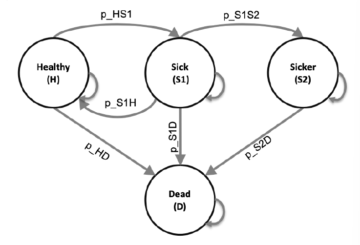

### 1. Introduction
This is a self-studying note by following the paper and R code from **Alarid-Escudero F et al. (2022)**. Most of the context in this note is extracted directly from the paper.

* Alarid-Escudero F, Krijkamp EM, Enns EA, Yang A, Hunink MGM, Pechlivanoglou P, Jalal H. An Introductory Tutorial on Cohort State-Transition Models in R Using a Cost-Effectiveness Analysis Example. Medical Decision Making, 2022 (Online First):1-18. https://doi.org/10.1177/0272989X221103163
<br>
<br>

#### 1.1. About the Study
A cohort state-transition model (cSTM), often referred to as Markov model, is a decision model commonly used in medical decision making to simulate the transitions of a hypothetical cohort among various health states over time. A cSTM is adopted when:

* decision problem has a dynamic component (ex: the disease process vary over time)
* decision problem can be described using a reasonable number of health states
* demand model ability to conduct probabilistic sensitivity analysis (PSA) and value-of-information (VOI) analyses
* evaluating screening and surveillance programs, diagnostic procedures, disease management programs, interventions, and policies.

The study focus on a **time-independent cSTM**, where transition probabilities among health state remain constant over time. The study demonstrates how to conduct a full cost-effectiveness analysis (CEA) comparing multiple interventions and implementing probabilistic sensitivity analysis (PSA) without needing a specialized cSTM package. 

```{r state-transition-diagram,fig.align='center', echo=FALSE}

```
<br>
<br>

#### 1.2. Markovian assumption
In a cSTM, the transition probabilities only depend on the current health state in a given cycle, meaning that the transition probabilities do not depend on the history of past transitions or time spent in a given state. This property is referred to as the "Markovian assumption". 
<br>
<br>

#### 1.3. Rates vs. probabilities
A **rate (u)** represents the **instantaneous** force of an event occurrence per unit time, while a **probability (p)** represents the **cumulative risk** of an event over a defined period. In other word, rate represent the rate of becoming sick in a given time, while probabilities represent what proportion of an initially healthly cohort becomes sick at the end of the year. The transition of rate and probabilities could use the following equation: *p = 1 - exp(-u)* . To note that rates and probabilities should have the same time scale while transitioning. 
<br>
<br>

#### 1.4. Strategies interested
We are interested in evaluating the cost-effectiveness of four strategies: the standard of care (strategy SoC), strategy A, strategy B, and a combination of strategies A and B (strategy AB):

* Strategy A involves administering treatment A that increases the QoL of individuals in S1 from 0.75 (utility without treatment, u_S1) to 0.95 (utility with treatment A, u_trtA). Treatment A costs $12,000 per year (c_trtA). This strategy does not impact the QoL of individuals in S2, nor does it change the risk of becoming sick or progressing through the sick states. 
* Strategy B uses treatment B to reduce only the rate of Sick individuals
progressing to the Sicker state by 40% (i.e., a hazard ratio (HR) of 0.6, hr_S1S2_trtB), costs $13,000 per year (c_trtB), and does not affect QoL. 
* Strategy AB involves administering both treatments A and B.

### 2. General Set Up

All parameters of the Sick-Sicker model use in the study is presented as follow. The naming of thease parameters and variables follows the notation descrived in the DARTH coding framework. 

Parameter | R name | Base-case | Distribution
--------- | ------ | --------- | ------------
Number of cycles (nT) | n_cycles | 75 years| - 
Names of health states (n) | v_names_states | H, S1, S2, D | - 
Annual discount rate for costs | d_c | 3% | -
Annual discount rate for QALYs | d_e | 3% | -
Number of PSA samples (K) | n_sim | 1,000 | -
- | - | - | -
Annual constant transition rates | | | 
Disease onset (H to S1) | r_HS1 | 0.150 | gamma(30, 200)
Recovery (S1 to H) | r_S1H | 0.500 | gamma(60, 120)
progression (S1 to S2) | r_S1S2 | 0.105 | gamma(84, 800)
- | - | - | -
Annual mortality | | | 
Background mortality rate (H to D) | r_HD | 0.002 | gamma(20, 10000)
Hazard ratio of death in S1 vs H | hr_S1 | 3.0 times | lognormal(3.0, 0.01)
Hazard ratio of death in S2 vs H | hr_S2 | 10.0 times | lognormal(10.0, 0.02)
- | - | - | -
Annual costs | | | 
Healthy individuals | c_H | $2,000 | gamma(100.0, 20.0)
Sick individuals in S1 | c_S1 | $4,000 | gamma(177.8, 22.5)
Sick individuals in S2 |c_S2 | $15,000 | gamma(225.0, 66.7)
Dead individuals | c_D | $0 | - 
- | - | - | -
Utility weights | | | 
Healthy individuals | u_H | 1.00 | beta(200, 3)
Sick individuals in S1 | u_S1 | 0.75 | beta(130, 45)
Sick individuals in S2 |u_S2 | 0.50 | beta(230, 230)
Dead individuals | u_D | 0.00 | - 
- | - | - | -
Treatment A cost and effectiveness | | |
Cost of treatment A, additional to state-specific health care costs | c_trtA | $12,000 | gamma(567.0, 20.8)
Utility for treated individuals in S1 | u_trtA | 0.95 | beta(300, 15)
- | - | - | -
Treatment B cost and effectiveness | | | 
Cost of treatment B, additional to state-specific health care costs | c_trtB | $12,000 | gamma(676.0, 19. 2)
Reduction in rate of disease progression (S1 to S2) as hazard ratio (HR) | hr_S1S2_trtB | 0.6 | lognormal(0.6, 0.1)
<br>

#### 2.1 Load packages 
```{r load-pakages, message=FALSE}
library(knitr)
library(kableExtra) 
library(dplyr)
library(reshape2)
library(ggplot2)
library(ggthemes) 
library(ggrepel) 
library(scales) 
library(ellipse) 
library(tidyr)
library(boot)
library(dampack)
library(darthtools)
library(devtools)
```
<br>

#### 2.2 Set up parameters 
```{r set-parameters}
### General setup
cycle_length <- 1 # cycle length equal one year (use 1/12 for monthly)
n_age_init <- 25 # age at baseline
n_age_max <- 100 # maximum age of follow up
n_cycles <- (n_age_max - n_age_init)/cycle_length #time horizon, number of cycles
v_names_states <- c("H", "S1", "S2", "D") # 4 states: Healthy (H), Sick (S1), Sicker (S2), Dead (D)
n_states <- length(v_names_states) # number of health states
d_e <- 0.03 # annual discount rate for QALYs of 3%
d_c <- 0.03 # annual discount rate for costs of 3%
v_names_str <- c("Standard of care", "Strategy A", "Strategy B", "Strategy AB") # store the strategy names
n_str <- length(v_names_str)


### Rate and hazard ratios (HRs)
r_HD <- 0.002 # constant annual rate of dying when Healthy (all-cause mortality rate)
r_HS1 <- 0.15 # constant annual rate of becoming Sick when Healthy
r_S1H <- 0.5 # constant annual rate of becoming Healthy when Sick
r_S1S2 <- 0.105 # constant annual rate of becoming Sicker when Sick
hr_S1 <- 3 # hazard ratio of death in Sick vs Healthy
hr_S2 <- 10 # hazard ratio of death in Sicker vs Healthy
r_S1D <- r_HD * hr_S1 # annual rate of dying when Sick
r_S2D <- r_HD * hr_S2 # annual rate of dying when Sicker
hr_S1S2_trtB <- 0.6 # hazard ratio of becoming Sicker when Sick under treatment B
r_S1S2_trtB <- r_S1S2 * hr_S1S2_trtB ## Transition probability of becoming Sicker when Sick for treatment B


### Transition probabilities (annual)
p_HS1 <- 1 - exp(-r_HS1 * cycle_length) ## Transition probability of becoming Sick when Healthy
p_S1H <- 1 - exp(-r_S1H * cycle_length) ## Transition probability of becoming Healthy when Sick
p_S1S2 <- 1 - exp(-r_S1S2 * cycle_length) ## Transition probability of becoming Sicker when Sick
p_S1S2_trtB <- 1 - exp(-r_S1S2_trtB * cycle_length)
p_HD <- 1 - exp(-r_HD * cycle_length) # annual background mortality risk (i.e., probability)
p_S1D <- 1 - exp(-r_S1D * cycle_length) # annual probability of dying when Sick
p_S2D <- 1 - exp(-r_S2D * cycle_length) # annual probability of dying when Sicker
# darthtools "rate_to_prob" is an alternative way to transfer


### Costs
c_H <- 2000 # annual cost of being Healthy
c_S1 <- 4000 # annual cost of being Sick
c_S2 <- 15000 # annual cost of being Sicker
c_D <- 0 # annual cost of being dead
c_trtA <- 12000 # annual cost of receiving treatment A
c_trtB <- 13000 # annual cost of receiving treatment B


### Utilities
u_H <- 1 # annual utility of being Healthy
u_S1 <- 0.75 # annual utility of being Sick
u_S2 <- 0.5 # annual utility of being Sicker
u_D <- 0 # annual utility of being dead
u_trtA <- 0.95 # annual utility when receiving treatment A
```
<br>

#### 2.3 Set up initial cohort stage
For the Sick-Sicker model, the cohort starts in the H state. Therefore, here create the 1 x ns initial state vector `v_m_init` with all of the cohort assigned to the H state:

```{r set-initial-state}
# initial state vector
v_m_init <- c(H = 1, S1 = 0, S2 = 0, D = 0) # initial state vector

```
<br>

#### 2.4 Initialize cohort trace table
The variable `v_m_init` is used to initialize M represented by `m_M` for the cohort under strategy SoC. We also create a trace for each of the other treatment-based strategies. 

```{r initial-cohort-state}
# Initialize cohort trace for standard of care (SoC)
m_M <-matrix(NA,
             nrow = (n_cycles + 1), ncol = n_states,
             dimnames = list(0:n_cycles, v_names_states))

# Store the initial state vector in the first row of the cohort trace
m_M[1, ] <- v_m_init

# Initialize cohort trace for strategies A, B, and AB
m_M_strA <- m_M # Strategy A
m_M_strB <- m_M # Strategy B
m_M_strAB <- m_M # Strategy AB
```
<br>

#### 2.5 Set up transition probability matrix
We initialize the matrix with default values of zero for all transition probabilities and then populate it with the corresponding transition probabilities. To access an element of `m_P`, we specify first the row
name (or number) and then the column name (or number) separated by a comma. We assume that all transitions to non-death states are
conditional on surviving to the end of a cycle. Thus, we first condition on surviving by multiplying the transition probabilities times `1 - p_HD`, the probability of surviving a cycle. We create the transition probability matrix for strategy A as a copy of the SoC’s transition probability matrix because treatment A does not alter the cohort’s transition probabilities.

```{r transition-matrix}
# Initialize transition probability matrix for strategy SoC
m_P <- matrix(0,
              nrow = n_states, ncol = n_states,
              dimnames = list(v_names_states, v_names_states)) # row and column names

# Fill in matrix
m_P["H", "H"] <- (1 - p_HD) * (1 - p_HS1)
m_P["H", "S1"] <- (1 - p_HD) * p_HS1
m_P["H", "D"] <- p_HD
m_P["S1", "H"] <- (1 - p_S1D) * p_S1H
m_P["S1", "S1"] <- (1 - p_S1D) * (1 - (p_S1H + p_S1S2))
m_P["S1", "S2"] <- (1 - p_S1D) * p_S1S2
m_P["S1", "D"] <- p_S1D
m_P["S2", "S2"] <- 1 - p_S2D
m_P["S2", "D"] <- p_S2D
m_P["D", "D"] <- 1

# Initialize transition probability matrix for strategy A as a copy of SoC's
m_P_strA <- m_P

```

Because treatment B alters progression from S1 to S2, we created a different transition probability matrix to model this treatment, `m_P_strB`. Strategy AB also alters progression from S1 to S2 because it uses treatment B, so we create this strategy’s transition probability matrix as a copy of the transition probability matrix of strategy B.

```{r transition-matrix2}
# Initialize transition probability matrix for strategy B
m_P_strB <- m_P

# Update only transition probabilities from S1 involving p_S1S2
m_P_strB["S1", "S1"] <- (1 - p_S1D) * (1 - (p_S1H + p_S1S2_trtB))
m_P_strB["S1", "S2"] <- (1 - p_S1D) * p_S1S2_trtB

# Initialize transition probability matrix for strategy AB as a copy of B's
m_P_strAB <- m_P_strB
```
<br>

#### 2.6 Check if probability matrices are valid
We verify they are valid by checking that each row sums to one and that each entry is between 0 and 1.

```{r valid-matrix-check, eval=FALSE, message=FALSE}
## Check that transition probabilities are [0, 1]
m_P >= 0 && m_P <= 1
m_P_strA >= 0 && m_P_strA <= 1
m_P_strB >= 0 && m_P_strB <= 1
m_P_strAB >= 0 && m_P_strAB <= 1

## Check that all rows sum to 1
rowSums(m_P) == 1
rowSums(m_P_strA) == 1
rowSums(m_P_strB) == 1
rowSums(m_P_strAB) == 1
```
<br>

### 3. Run Markov Model (Cohort trace cycles)
Next, we obtain the cohort distribution across the `r n_states` states over `r n_cycles` cycles using a time-independent cSTM  under all four strategies. To achieve this, we iteratively compute the matrix product between each of the rows of `m_M` and `m_P`, and  between `m_M_strB` and `m_P_strB`, respectively, using the `%*%` symbol in R at each cycle using a `for` loop

```{r run-markov}
# Iterative solution of time-independent cSTM
for(t in 1:n_cycles){
  m_M[t + 1, ] <- m_M[t, ] %*% m_P # For SoC
  m_M_strA[t + 1, ] <- m_M_strA[t, ] %*% m_P_strA  # For strategy A
  m_M_strB[t + 1, ] <- m_M_strB[t, ] %*% m_P_strB  # For strategy B
  m_M_strAB[t + 1, ] <- m_M_strAB[t, ] %*% m_P_strAB  # For strategy AB
}
# %*% = matrix multiplier
```
<br>

#### 3.1 Cohort trace cycles results
```{r cohor-cycle-chart, warning=FALSE, fig.align='center'}
cols <- get_DARTH_cols()
lty <-  c("H" = 1, "S1" = 2, "S2" = 4, "D" = 3)
ggplot(reshape2::melt(m_M), aes(x = Var1, y = value, 
                      color = Var2, linetype = Var2)) +
  geom_line(size = 1) +
  scale_colour_manual(name = "Health state", 
                     values = cols) +
  scale_linetype_manual(name = "Health state",
                        values = lty) +
  scale_x_continuous(breaks = number_ticks(8)) + 
  xlab("Cycle") +
  ylab("Proportion of the cohort") +
  theme_bw(base_size = 16) +
  theme(legend.position = "bottom",#c(0.7, 0.75), 
        legend.background = element_rect(fill = NA))
```


### 4. Cost and effectiveness outcomes

#### 4.1 State rewards
A state reward refers to a value assigned to individuals for being in a given health state. These could be either utilities or costs associated with remaining in a specific health state for one cycle in a CEA context. To calculate the state utility, we compute the matrix product of the cohort trace matrix times
a vector of state rewards r of the same dimension as the number of states (nS), such that y = M x r.

Here we calculate state reward under SOC:
```{r soc-rewards}
## State rewards under SOC 
v_u_SoC <- c(H = u_H, S1 = u_S1, S2 = u_S2, D = u_D) * cycle_length # Vector of state utilities under SOC
v_c_SoC <- c(H = c_H, S1 = c_S1, S2 = c_S2, D = c_D) * cycle_length # Vector of state costs under SoC
v_qaly_SoC <- m_M %*% v_u_SoC # Vector of QALYs under SoC
v_cost_SoC <- m_M %*% v_c_SoC # Vector of costs under SoC
```

we calculate state reward for strategy A:
```{r a-rewards}
## State rewards for strategy A
v_u_strA <- c(H = u_H, S1 = u_trtA, S2 = u_S2, D = u_D) * cycle_length # Vector of state utilities for strategy A
v_c_strA <- c(H = c_H, S1 = c_S1 + c_trtA, S2 = c_S2 + c_trtA, D = c_D) * cycle_length # Vector of state costs for strategy A
v_qaly_strA <- m_M_strA %*% v_u_strA # Vector of QALYs for strategy A
v_cost_strA <- m_M_strA %*% v_c_strA # Vector of costs for strategy A
```

we calculate state reward for strategy B:
```{r b-rewards}
## State rewards for strategy B
v_u_strB <- c(H = u_H, S1 = u_S1, S2 = u_S2, D = u_D) * cycle_length # Vector of state utilities for strategy B
v_c_strB <- c(H = c_H, S1 = c_S1 + c_trtB, S2 = c_S2 + c_trtB, D = c_D) * cycle_length # Vector of state costs for strategy B
v_qaly_strB <- m_M_strB %*% v_u_strB # Vector of QALYs for strategy B
v_cost_strB <- m_M_strB %*% v_c_strB # Vector of costs for strategy B 
```

we calculate state reward for strategy AB:
```{r ab-rewards}
## State rewards for strategy AB
v_u_strAB <- c(H = u_H, S1 = u_trtA, S2 = u_S2, D = u_D) * cycle_length # Vector of state utilities for strategy AB
v_c_strAB <- c(H = c_H, S1 = c_S1 + (c_trtA + c_trtB), S2 = c_S2 + (c_trtA + c_trtB), D = c_D) * cycle_length # Vector of state costs for strategy AB
v_qaly_strAB <- m_M_strAB %*% v_u_strAB # Vector of QALYs for strategy AB
v_cost_strAB <- m_M_strAB %*% v_c_strAB # Vector of costs for strategy AB
```
<br>

#### 4.2 Reduce biases of discretization (Optional section)
A discrete-time cSTM involves an approximation of continuous-time dynamics to discrete points in time. The discretization might introduce biases when estimating outcomes based on state occupancy. One approach to reducing these biases is to shorten the cycle length, requiring simulating the model for a larger number of cycles, which can be computationally burdensome. Another approach is to use within-cycle corrections (WCC). This study adopt the Simpson's 1/3rd rule of WCC approach for costs and QALYs. 
<br>

<center> wcc = [1/3, 2/3, 4/3, ..., 1/3] </center>
<br>

```{r wcc-setup}
# First, we define two functions to identify if a number is even or odd
is_even <- function(x) x %% 2 == 0
is_odd <- function(x) x %% 2 != 0

## Then we create a vector with cycles
v_cycles <- seq(1, n_cycles + 1)

## Generate 2/3 and 4/3 multipliers for even and odd entries, respectively
v_wcc <- is_even(v_cycles)*(2/3) + is_odd(v_cycles)*(4/3)

## Substitute 1/3 in first and last entries
v_wcc[1] <- v_wcc[n_cycles + 1] <- 1/3
```
<br>

#### 4.3 Discounting future rewards
The discount vectors for costs and QALYs for the Sick-Sicker model with annual cycles, `v_dwc` and `v_dwe`, respectively, scaled by the cycle length:
```{r discounting}
# Discount weight for effects
v_dwe <- 1 / ((1 + (d_e * cycle_length))^(0:n_cycles))

# Discount weight for costs
v_dwc <- 1 / ((1 + (d_c * cycle_length))^(0:n_cycles))
```

Compute the total expected discounted QALYs and costs under all four strategies accounting for both discounting and WCC: 
```{r compute-wcc}
## For SoC
n_tot_qaly_SoC <- t(v_qaly_SoC) %*% (v_dwe * v_wcc) # Expected discounted QALYs
n_tot_cost_SoC <- t(v_cost_SoC) %*% (v_dwc * v_wcc) # Expected discounted costs

## For strategy A
n_tot_qaly_strA <- t(v_qaly_strA) %*% (v_dwe * v_wcc) # Expected discounted QALYs
n_tot_cost_strA <- t(v_cost_strA) %*% (v_dwc * v_wcc) # Expected discounted costs

## For strategy B
n_tot_qaly_strB <- t(v_qaly_strB) %*% (v_dwe * v_wcc) # Expected discounted QALYs
n_tot_cost_strB <- t(v_cost_strB) %*% (v_dwc * v_wcc) # Expected discounted costs

## For strategy AB
n_tot_qaly_strAB <- t(v_qaly_strAB) %*% (v_dwe * v_wcc) # Expected discounted QALYs
n_tot_cost_strAB <- t(v_cost_strAB) %*% (v_dwc * v_wcc) # Expected discounted costs
``` 
<br>

#### 4.4 Cost and QALYs Results

Here represent the total expected discounted QALYs and costs per average individual in the cohort of the Sick-Sicker model by strategy accounting for within-cycle correction:

```{r cost-and-qalys}
# Set up table input
m_outcomes <- matrix(c(dollar(c(n_tot_cost_SoC, n_tot_cost_strA, n_tot_cost_strB, n_tot_cost_strAB)), format(round(c(n_tot_qaly_SoC, n_tot_qaly_strA, n_tot_qaly_strB, n_tot_qaly_strAB), 3), nsmall = 3)), ncol = 2, nrow = length(v_names_str), dimnames = list(v_names_str, c("Costs", "QALYs")))

# Create Table
kable(m_outcomes, booktabs = TRUE, align = c("l", "c", "c")) %>% 
  kable_styling(latex_options = "hold_position")
```
<br>

### 5. Incremental cost-effectiveness ratios (ICERs)
We combine the total expected discounted costs and QALYs for all four strategies into outcome-specific vectors, `v_cost_str` for costs and `v_qaly_str` for QALYs. Then we use `da,pack::calculte_1cers` to calculate ICERs between non-dominated strategies and create a data frame `df_cea` with this information. 

```{r ICERs}
# Set vector of costs and effectiveness
v_cost_str <- c(n_tot_cost_SoC, n_tot_cost_strA, n_tot_cost_strB, n_tot_cost_strAB)
v_qaly_str <- c(n_tot_qaly_SoC, n_tot_qaly_strA, n_tot_qaly_strB, n_tot_qaly_strAB) 

# Calculte ICERs 
df_cea <- calculate_icers(cost = v_cost_str, effect = v_qaly_str, strategies = v_names_str)

# Generate CEA table
table_cea <- format_table_cea(df_cea) 
df_cea # I disply `df_cea` as its more easy to read
```

```{r cea-frontier, fig.align='center'}
# Generate CEA frontier 
plot(df_cea, label = "all", txtsize = 16) + expand_limits(x = max(table_cea$QALYs) + 0.1) + theme(legend.position = c(0.8, 0.2))
```
<br>
<br>

### 6. Probabilistic sensitivity analysis (PSA)

To quantify the effect of model parameter uncertainty on cost-effectiveness outcomes, we conducted a PSA by randomly drawing parameter sets (`n_sim`) from distributions that reflect the current uncertainty in model parameter estimates.
<br>
<br>

#### 6.1 Source PSA fuction from the authors GitHub repository

The author of the study wrote 3 functions in R to conduct PSA, here I will use `source_url` function to soucre the function code manuscript from the authors GitHub repository . The 3 function lists below:

1. `generate_psa_params(n_sim, seed)`: a function that generates a sample of size `n_sim` for the model parameters, `df_psa_input`, from their distributions defined in Table. The function input `seed` sets the seed of the pseudo-random number generator used in sampling parameter values, which ensures reproducibility of the PSA results. 

2. `decision_model(l_params_all, verbose = FALSE)`: a function that wraps the R code of the time-independent cSTM described in section. This function requires inputting a list of all model parameter values, `l_params_all` and whether the user wants print messages on whether transition probability matrices are valid via the `verbose` parameter.

3. `calculate_ce_out(l_params_all, n_wtp = 100000)`: a function that calculates total discounted costs and QALYs based on the `decision_model` function output. This function also computes the net monetary benefit (NMB) for a given willingness-to-pay threshold, specified by the argument `n_wtp`.

```{r github-outsource, message=FALSE}
source_url("https://github.com/DARTH-git/cohort-modeling-tutorial-intro/blob/15517d74ec1e6e1bd8a36f7c17263ddd0e332984/R/Functions_cSTM_time_indep.R?raw=TRUE")

```
<br>

#### 6.2 PSA set up
To conduct the PSA of the CEA using the time-independent Sick-Sicker cSTM, we sampled 1,000 parameter sets from their distributions. We assumed commonly used distributions to describe their uncertainty for each type of parameter.


```{r PSA-setup}
# Number of PSA samples
n_sim <- 1000

# Generate PSA input dataset
df_psa_input <- generate_psa_params(n_sim = n_sim)

# Initialize matrices with PSA output (data.frame of costs and effectiveness)
df_c <- as.data.frame(matrix(0, nrow = n_sim, ncol = n_str))
colnames(df_c) <- v_names_str
df_e <- as.data.frame(matrix(0, nrow = n_sim, ncol = n_str))
colnames(df_e) <- v_names_str

# create list of input parameter for PSA
l_params_all <- list(
  r_HD = 0.002, # constant rate of dying when Healthy (all-cause mortality)
  r_HS1 = 0.15, # probability to become Sick when Healthy conditional on surviving
  r_S1H = 0.5, # probability to become Healthy when Sick conditional on surviving
  r_S1S2 = 0.105, # probability to become Sicker when Sick conditional on surviving
  hr_S1 = 3,  # hazard ratio of death in Sick vs Healthy 
  hr_S2 = 10, # hazard ratio of death in Sicker vs Healthy 
  hr_S1S2_trtB = 0.6,  # hazard ratio of becoming Sicker when Sick under treatment B
  c_H    = 2000,  # cost of remaining one cycle in Healthy 
  c_S1   = 4000,  # cost of remaining one cycle in Sick 
  c_S2   = 15000, # cost of remaining one cycle in Sicker 
  c_D    = 0,     # cost of being dead (per cycle)
  c_trtA = 12000, # cost of treatment A
  c_trtB = 13000, # cost of treatment B
  u_H    = 1,     # utility when Healthy 
  u_S1   = 0.75,  # utility when Sick 
  u_S2   = 0.5,   # utility when Sicker
  u_D    = 0,     # utility when Dead 
  u_trtA = 0.95, # utility when being treated with A
  n_age_init = 25,
  n_age_max = 100,
  d_c = 0.03, # annual discount rate for costs 
  d_e = 0.03, # annual discount rate for QALYs,
  cycle_length = 1
)

# Store the parameter names into a vector
v_names_params <- names(l_params_all)
```
<br>

#### 6.3 Run PSA
```{r PSA-run ,results='hide', warning=FALSE}
for(i in 1:n_sim){
  l_psa_input <- update_param_list(l_params_all, df_psa_input[i,])
  l_out_temp <- calculate_ce_out(l_psa_input)
  df_c[i, ]  <- l_out_temp$Cost  
  df_e[i, ]  <- l_out_temp$Effect}
```

After running PSA, we create PSA object to prepare for PSA visualization.   
```{r PSA-object ,warning=FALSE}
# Create PSA object for dampack
l_psa <- make_psa_obj(cost          = df_c, 
                      effectiveness = df_e, 
                      parameters    = df_psa_input, 
                      strategies    = v_names_str)
l_psa$strategies <- v_names_str
colnames(l_psa$effectiveness)<- v_names_str
colnames(l_psa$cost)<- v_names_str

# Vector with willingness-to-pay (WTP) thresholds.
v_wtp <- seq(0, 200000, by = 5000)

## Cost-effectiveness acceptability curves (CEACs) and frontier (CEAF)
ceac_obj <- ceac(wtp = v_wtp, psa = l_psa)
ceac_obj$Strategy <- ordered(ceac_obj$Strategy, v_names_str)

##  Expected Loss Curves (ELCs)
elc_obj <- calc_exp_loss(wtp = v_wtp, psa = l_psa)
```
<br>

#### 6.4.1. Result of PSA: cost-effectiveness scatter plot
The joint distribution, 95% confidence ellipse, and the expected values of the total discounted costs and QALYs for each strategy is plotted in a **cost-effectiveness scatter plot**, where each of the 1,000 simulations are plotted as a point in the graph. The CE scatter plot for CEA using the time-independent model shows that strategy AB has the highest expected costs and QALYs. Standard of care has the lowest expected cost and QALYs. Strategy B is more effective and least costly than Strategy A. Strategy A is a strongly dominated strategy.

```{r CEA-scatter, message=FALSE, fig.align='center'}
# Cost-effectiveness scatter plot
plot(l_psa, txtsize = 16) +
  ggthemes::scale_color_colorblind() +
  ggthemes::scale_fill_colorblind() +
  xlab("Effectiveness (QALYs)") +
  guides(col = guide_legend(nrow = 2)) +
  theme(legend.position = "bottom")
```
<br>
<br>

#### 6.4.2. Result of PSA: cost-effectiveness acceptability curves (CEACs)
We also presents the result in the **cost-effectiveness acceptability curves (CEACs)**, which show the probability that each strategy is cost-effective, and the cost-effectiveness frontier (CEAF), which shows the strategy with the highest expected net monetary benefit (NMB), over a range of willingness-to-pay (WTP) thresholds. At WTP thresholds less than 80,000 per QALY gained, strategy SoC has both the highest probability of being cost-effective and the highest expected NMB. This switches to strategy B for WTP thresholds between 80,000 and 120,000 per QALY gained and to strategy AB for WTP thresholds greater than or equal to 120,000 per QALY gained.

```{r CEACs-plot, message=FALSE, fig.align='center'}
plot(ceac_obj, txtsize = 16, xlim = c(0, NA), n_x_ticks = 14) +
  ggthemes::scale_color_colorblind() +
  ggthemes::scale_fill_colorblind() +
  theme(legend.position = c(0.82, 0.5))
```
<br>
<br>

#### 6.4.3. Result of PSA: expected loss curves (ELCs)
The CEAC and CEAF do not show the magnitude of the expected net benefit lost (i.e., expected loss) when the chosen strategy is not the cost-effective strategy in all the samples of the PSA. To complement these results, we quantify expected loss from each strategy over a range of WTP thresholds with the **expected loss curves (ELCs)**. These curves quantify the expected loss from each strategy over a range of WTP thresholds. 

```{r ELC-plot, message=FALSE, fig.align='center'}
# ELC plot
plot(elc_obj, log_y = FALSE, 
     txtsize = 16, xlim = c(0, NA), n_x_ticks = 14,
     col = "full") +
  ggthemes::scale_color_colorblind() +
  ggthemes::scale_fill_colorblind() +
  # geom_point(aes(shape = as.name("Strategy"))) +
  scale_y_continuous("Expected Loss (Thousand $)", 
                     breaks = number_ticks(10),
                     labels = function(x) x/1000) +
  theme(legend.position = c(0.4, 0.7))
```

